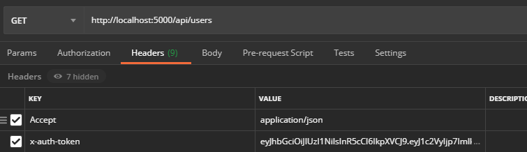

# BTS Code Test

This application using Node.JS and Mongoose for the database

## Install dependencies

```
npm install
```

## Token

This application using JWT token, that passed in header using 'x-auth-token' key.



## Run the server

```
nodemon index
```

## Import Postman File

Import postman file from _"postman - doc"_ folder
